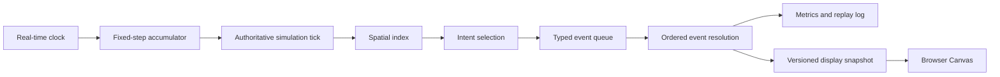

# Specimens Simulation Optimization Roadmap

## Goal

Make Specimens deterministic, speed-invariant, explainable, and able to scale past its current 42 specimens while retaining responsive browser rendering. Work is ordered deliberately: establish correctness and measurements first, then optimize hot paths, then add ecological depth.

## Reference Analysis

### Original Terrarium Browser Repository

The public [terrariumapp/terrarium-game](https://github.com/terrariumapp/terrarium-game) repository contains a README and browser-host wrapper for the original .NET Terrarium ecosystem. It does not include the original simulation engine or creature implementation, so there is no source code to port directly.

Useful product principles to retain:

- The simulation is server-authoritative and viewable from a browser at any time.
- Creature rules should be local, simple, and produce legible ecosystem outcomes.
- Rendering is a presentation concern and must not be responsible for simulation state.

### Py Creatures

[Py Creatures](https://www.thinkcreatelearn.co.uk/resources/c2-pycreatures/index.html) uses an explicit per-creature `tick()` contract, bounded acceleration and velocity, inspectable live creature data, and interaction callbacks. It is a classroom system rather than a scaling architecture, but it informs three useful decisions for Specimens:

- Define one clear tick/time contract for every entity.
- Keep movement parameters explicit and physically bounded.
- Make each specimen's current state and decision inspectable in the UI.

### Python Ecosystem Simulation

[Simon Oesterberg's Python Ecosystem Simulation](https://github.com/SimonOesterberg/Python-Ecosystem-Simulation) separates a grid world, creature vital thresholds, simulation orchestration, and repeated-run statistics. Its discrete grid is too restrictive for the continuous 1000x1000 Specimens world, but its core lessons apply:

- Spatial locality should be first-class, using a uniform grid index rather than repeated scans of all entities.
- Run statistics across repeated seeded simulations are essential for balancing.
- Configuration should describe population, terrain, resources, and behavior parameters instead of burying all tuning values inside action code.

### Pygame And Python.NET

Pygame is useful for a standalone local visual sandbox, but it would duplicate the existing Canvas client and does not solve the current engine bottlenecks. It is not on the critical path.

[Python.NET](https://github.com/pythonnet/pythonnet) can bridge Python and the CLR, including embedded Python in a .NET application. It is only relevant if Specimens is intentionally migrated into the original .NET Terrarium ecosystem. It adds CLR runtime packaging, Python DLL configuration, thread/GIL management, and cross-language debugging. Keep Specimens as a native Python engine unless that migration becomes a separate product requirement.

## Current Specimens Findings

1. **The speed slider changes simulation semantics.** `Simulation.run()` calls `step(0.1 * time_scale)`. Aging, hunger, weather, plant growth, and animal movement use that duration. Human movement, combat, sleep recovery, stamina use, and several action effects occur once per tick instead. At high speed, agents accumulate hours of needs while moving only one normal movement step.

2. **Proximity rules repeatedly scan every entity.** Every awake specimen evaluates 24 utilities each tick. Actions such as conflict, flee, donation, theft, reproduction, socializing, hunting, and resource gathering scan all specimens or resources and calculate distances. This trends toward $O(N^2 + N \times R)$ per tick.

3. **Shared state is mutated during action evaluation.** Fights, hunts, births, and deaths can modify state while the remaining agents still act. List copies prevent immediate iteration errors, but action ordering is implicit and replaying a run is difficult.

4. **WebSocket updates transmit complete state every 100 ms.** The server does correctly build and encode one packet per broadcast rather than per client, but it retransmits static zones and every entity and sends clients sequentially. This will become costly as viewers and population grow.

5. **Experiments are not reproducible.** The simulation uses global random calls without a persisted seed. The ecology suite includes a random retry-loop test, making it flaky rather than a reliable regression check.

6. **The runtime cleanup policy needs consolidation.** Death markers currently age out only when a later death records another marker. Cleanup belongs in a regular end-of-tick phase so the documented time window is always true.

## Target Shape

## Phase 0: Determinism And Measurement

**Outcome:** Comparisons and optimization decisions are trustworthy.

1. Accept an optional seed in `Simulation`; use a per-simulation `random.Random`.
2. Route all random behavior through that instance: spawning, weather, ecology, reproduction, actions, and names.
3. Record a run manifest: seed, scenario, intensity, engine version, start/end tick, and final population/ecology/economy summary.
4. Add rolling metrics for p50/p95 tick duration, decision count, nearby-query count, event count, packet bytes, encode duration, and active client count.
5. Add a benchmark for 42, 100, 250, and 500 agents over ten simulated days.
6. Replace random retry tests with seeded or controlled outcomes.

**Done when:** the same manifest produces the same checkpoint summaries, the test suite is non-flaky, and an initial benchmark baseline is recorded.

## Phase 1: Fixed-Step, Speed-Invariant Time

**Outcome:** The same seed produces materially equivalent world states at 1x and 100x speed.

1. Define one fixed simulation interval `dt` and express every state change as a rate multiplied by `dt`.
2. Make the speed control add simulated time to an accumulator. Consume it as bounded fixed substeps rather than calling a single huge `step()`.
3. Time-scale human movement, fleeing, combat damage, sleep recovery, stamina, bar effects, social gains, and random-event probabilities.
4. Give agents a short-lived intent and target; only replan on a regular simulated schedule or when an emergency interrupts the intent.
5. Set a per-frame substep budget. If 10,000x cannot be simulated faithfully, provide a named fast-forward mode with documented coarse rules instead of silently changing outcomes.
6. Add differential tests comparing a one-day seeded run scheduled at multiple rates, with explicit tolerances for positions, needs, money, births, and deaths.

**Done when:** no entity exceeds configured speed times `dt`, and ordinary travel remains viable at every supported simulation speed.

## Phase 2: Decisions, Arrival, And Event Resolution

**Outcome:** Players can answer why an agent acted, and simultaneous actions resolve predictably.

1. Split `BehaviorEngine.choose()` into pure utility helpers: needs, safety, social, economy, reproduction, and exploration. Preserve current scores before rebalancing them.
2. Return a `Decision` with action, target, score contributors, and top alternatives. Store this in a bounded trace ring buffer, not console output.
3. Add `target_id`, `target_position`, `intent_started_tick`, arrival threshold, and action cooldown state to each specimen.
4. Introduce typed events: `Move`, `Arrive`, `Consume`, `Interact`, `Trade`, `Attack`, `Birth`, and `Death`.
5. Resolve events in fixed order: validation, movement/arrival, consumption, social/economic transfer, combat, births, deaths, cleanup.
6. Perform death marker expiration and dead-entity removal in that cleanup phase.

**Done when:** a dead entity cannot act later in the same tick; contested resources resolve deterministically; the UI can show a current target and decision reasons.

## Phase 3: Spatial Index And Population Scaling

**Outcome:** Nearby interaction cost grows with local density, not the whole population.

1. Add a `World`-owned uniform spatial grid with cells around 80-100 metres.
2. Index specimens, deer, bears, plants, shelters, and zones after movement.
3. Replace global scans first in conflict, flee, social, donation, theft, reproduction, chase-deer, and forest-resource targeting.
4. Cache immutable zone centers and species collections.
5. Reprofile before adding utility-result caches; their invalidation risk is higher than their likely initial benefit.
6. Add capped soft separation after the grid exists so crowded venues are visually meaningful without adopting a full physics engine.

**Done when:** the 250-agent p95 step is below 50 ms on the development machine, and the 500-agent p95 is below 100 ms or uses an explicitly reduced decision cadence.

## Phase 4: Transport And Rendering

**Outcome:** Viewer count does not unnecessarily tax the engine.

1. Send static world data in a `world_init` packet on connect/reset.
2. Keep dynamic state in a versioned snapshot at a measured display rate.
3. Introduce changed-entity create/update/remove deltas only if Phase 0 metrics show snapshot bytes or JSON encoding to be a meaningful bottleneck.
4. Send bounded event history separately from live entity state.
5. Broadcast concurrently with a bounded timeout; remove clients that cannot keep up so one slow client cannot delay all viewers.
6. Update Canvas/DOM inspector state only when selected or displayed values change.

**Done when:** static zones are absent from routine updates, a slow socket does not delay healthy viewers, and reconnect recovery works from a full snapshot.

## Phase 5: Ecosystem And Gameplay Depth

**Outcome:** New simulation systems build on stable time, events, and metrics.

1. Create seeded long-run ecology tests for plant, deer, and bear stability.
2. Add building entrances and forest-edge waypoints before considering full A* pathfinding.
3. Tie jobs to traits and experience with measurable output differences.
4. Make intoxication affect bounded decision risk/noise and test it deterministically.
5. Build a dashboard from metrics/events: population health, births/deaths by cause, wealth, homelessness, actions, ecology, p95 tick time, and packet size.

## Explicitly Deferred

- Full physics engine or collision system.
- Behavior trees, GOAP, or learned policies.
- Pygame desktop renderer.
- Python.NET or a .NET Terrarium migration.
- Web Workers, binary protocols, compression, and full A* pathfinding.

These tools may be appropriate later, but current evidence points first to time correctness, deterministic experiments, localized queries, and measured network payload reduction.

## Implementation Order

1. Phase 0: seed, benchmark, metrics, reliable tests.
2. Phase 1: fixed substeps and time-scaled actions.
3. Phase 2: target/arrival state and ordered event resolution.
4. Phase 3: spatial grid and hot-query migration.
5. Phase 4: transport changes guided by collected metrics.
6. Phase 5: ecology and gameplay extensions.
